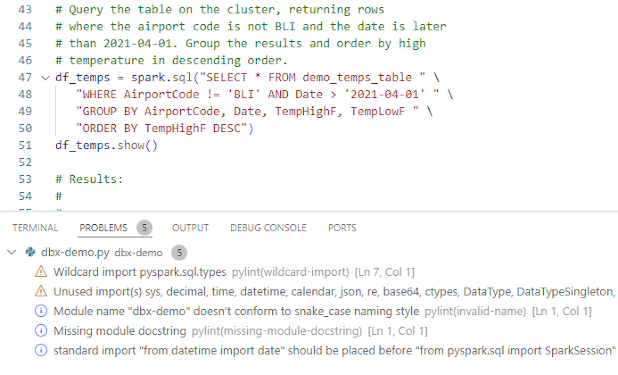
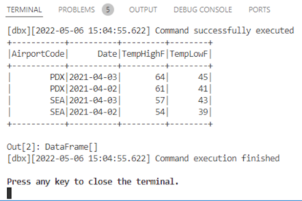

# Python 3 - Pyspark - Databricks - dbx

## Summary

*Develop Pyspark applications under a fully configured Python 3 development environment. Send jobs to your Databricks workspace using dbx directly from VS Code.*




*This definition is an extension of the Python 3 one. See the details [here](https://github.com/microsoft/vscode-dev-containers/blob/main/containers/python-3/README.md).*

## Using this definition

### Step 1 - From the cloned repo, create your own branch for experimentation

```bash
git checkout -b testing
```

### Step 2 - Get VS Code Remote - Containers extension.

You can get it [here](https://aka.ms/vscode-remote/download/containers).

### Step 3 - Click on the Remote Window toolbox and then `Open Folder in Container...`


### Step 4 - Browse to this repo (your branch should be active)

### Step 5 - Once the container has been loaded, check that your python versions for Databricks and for the container are compatible

To check Databricks, use a simple magic command in a notebook cell:

```text
%sh
python --version
```

To check the container, launch this python command from your current terminal:

```bash
python --version
```

### Step 6 - Press `CTRL + SHIFT + P` and select `Tasks: Run Task` and then `New dbx project`

You will need to choose a name for your project. You also will be asked about your Databricks configuration in these terms:

- Databricks host
- Databricks PAT (Personal Access Token)
- Databricks Cluster ID

A new folder with the name of your project will be created. The Databricks configuration files will be stored inside under `project_name/conf/databricks-config.sh` file, but for security reasons these data will not be tracked by the repo.

Press a key to close the terminal.

### Step 7 - Add your code to the recently created file `project_name/project_name.py`

By default, a simple pyspark template is deployed:

```python
# For testing and debugging of local objects, run
# "pip install pyspark=X.Y.Z", where "X.Y.Z"
# matches the version of PySpark
# on your target clusters.
from pyspark.sql import SparkSession

from pyspark.sql.types import *
from datetime import date

spark = SparkSession.builder.appName("dbx-demo").getOrCreate()

# Create a DataFrame consisting of high and low temperatures
# by airport code and date.
schema = StructType([
   StructField('AirportCode', StringType(), False),
   StructField('Date', DateType(), False),
   StructField('TempHighF', IntegerType(), False),
   StructField('TempLowF', IntegerType(), False)
])

data = [
   [ 'BLI', date(2021, 4, 3), 52, 43],
   [ 'BLI', date(2021, 4, 2), 50, 38],
   [ 'BLI', date(2021, 4, 1), 52, 41],
   [ 'PDX', date(2021, 4, 3), 64, 45],
   [ 'PDX', date(2021, 4, 2), 61, 41],
   [ 'PDX', date(2021, 4, 1), 66, 39],
   [ 'SEA', date(2021, 4, 3), 57, 43],
   [ 'SEA', date(2021, 4, 2), 54, 39],
   [ 'SEA', date(2021, 4, 1), 56, 41]
]

temps = spark.createDataFrame(data, schema)

...
```

### Step 8 - Once you are ready, press `CTRL + SHIFT + P` and select `Tasks: Run Task` and then `Run dbx project` to send a job to your Databricks workspace

You will be asked again about the name of your project. If everything works fine, you should see the result of the execution on a new terminal window:



Press a key to close the terminal.

### Step 9 - Finally, to close the remote session with the container, click again on the Remote Windows toolbox and select Close Remote Session

## License

Licensed under the MIT License. See [LICENSE](https://github.com/microsoft/vscode-dev-containers/blob/main/LICENSE)

